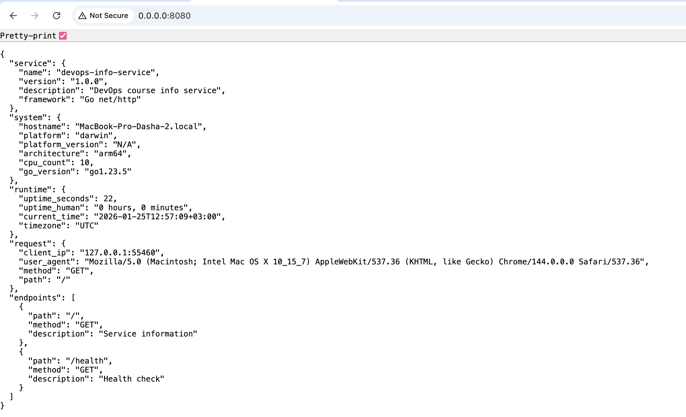
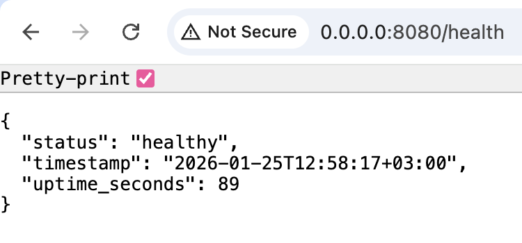
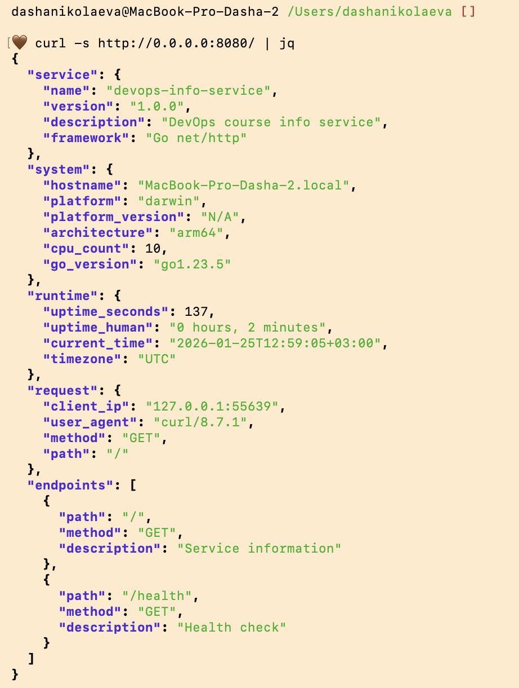

# Lab 01 — Go Info Service Implementation (Bonus)

## Language Justification

I chose **Go** for the compiled language implementation because of its efficiency in containerized environments and its robust standard library. For a detailed comparison, see [GO.md](GO.md).

## Best Practices applied

1.  **Struct-based JSON**: Used Go structs with JSON tags (`json:"..."`) to ensure consistent API responses.
2.  **Standard Library**: Leveraged `net/http` to avoid bloated third-party dependencies.
3.  **Graceful Configuration**: Implementation of environment variable checking for `PORT` and `HOST`.
4.  **Formatting**: Result follows the exact JSON schema requested in the lab requirements.

## API Documentation

The Go implementation mirrors the Python API exactly:

### GET `/`
- **Description**: Returns complete service and system information.
- **Example Response**:
```json
{
  "service": {
    "name": "devops-info-service",
    "version": "1.0.0",
    "description": "DevOps course info service",
    "framework": "Go net/http"
  },
  "system": {
    "hostname": "my-macbook",
    "platform": "darwin",
    "architecture": "arm64",
    "cpu_count": 8,
    "go_version": "go1.21.0"
  },
  "runtime": {
    "uptime_seconds": 120,
    "uptime_human": "0 hours, 2 minutes",
    "current_time": "2026-01-25T12:50:00Z",
    "timezone": "UTC"
  }
}
```

### GET `/health`
- **Description**: Health check endpoint.
- **Response**: `{"status": "healthy", "timestamp": "...", "uptime_seconds": ...}`

## Testing Evidence

### Screenshots
- 
- 
- 

### Terminal Output
```bash
$ go run main.go
2026/01/25 12:56:47 Starting server on 0.0.0.0:8080
```

## Challenges & Solutions

- **Challenge**: Retrieving Platform Version in Go.
- **Solution**: Go's `runtime` package doesn't provide the OS version as easily as Python. I decided to set it to "N/A" for now, as the core requirements (OS, Arch, CPU) are met.
