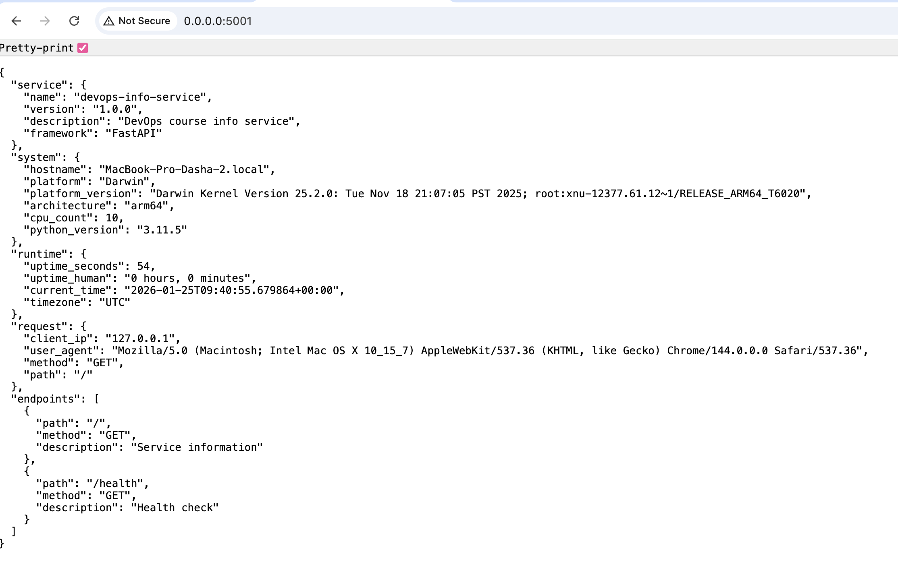
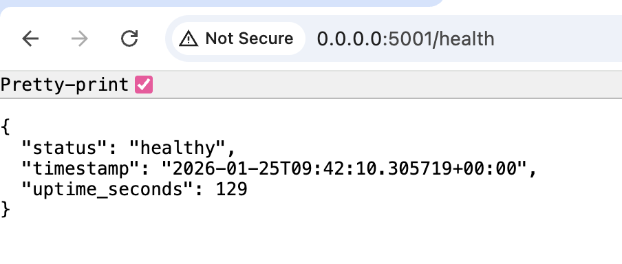
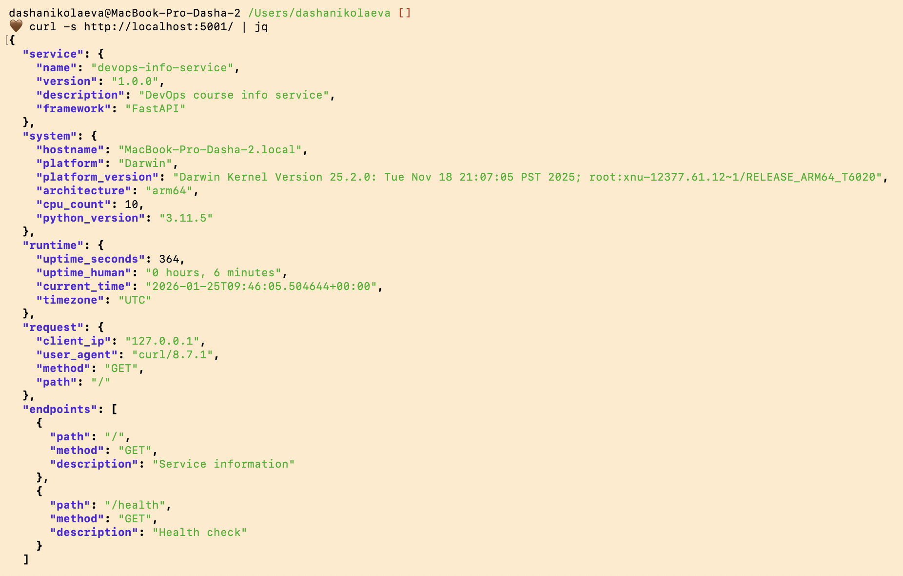

# Lab 01 — Python Info Service Documentation

## Framework Selection

For this lab, I chose **FastAPI**.

### Justification
- **Modern & Async**: FastAPI is built on modern Python standards and supports asynchronous programming out of the box.
- **Auto-Documentation**: It automatically generates OpenAPI (Swagger) documentation, which is excellent for DevOps workflows.
- **Performance**: High performance comparable to Node.js and Go.
- **Type Safety**: Leverages Python type hints for data validation and serialization.

### Comparison Table

| Feature | Flask | FastAPI | Django |
|---------|-------|---------|--------|
| **Approach** | Minimalist | Modern/Async | Full-featured |
| **Learning Curve** | Low | Low-Medium | High |
| **Auto-Docs** | No (requires plugins) | Yes (built-in) | No |
| **Validation** | External (marshmallow/pydantic) | Pydantic (built-in) | DRF (external) |

## Best Practices Applied

1. **Clean Code**: Followed PEP 8 standards, used descriptive names, and type hints.
2. **Error Handling**: Implemented custom exception handlers for 404 and 500 errors.
3. **Logging**: Configured `logging` to track application events and errors.
4. **Environment Variables**: Used `os.getenv` with defaults for configuration (HOST, PORT).
5. **Dependency Management**: Pinned versions in `requirements.txt`.

## API Documentation

### GET `/`
- **Description**: Returns complete service and system information.
- **Response**: JSON object with `service`, `system`, `runtime`, and `request` details.

### GET `/health`
- **Description**: Health check endpoint.
- **Response**: `{"status": "healthy", "timestamp": "...", "uptime_seconds": ...}`

### Testing Evidence

To verify the application, I ran it locally and tested the endpoints.

**Screenshots:**
- 
- 
- 

### Terminal Output
```bash
$ python3 app.py
2026-01-25 12:40:01,122 - __main__ - INFO - Starting server on 0.0.0.0:5001
INFO:     Started server process [57379]
INFO:     Waiting for application startup.
INFO:     Application startup complete.
INFO:     Uvicorn running on http://0.0.0.0:5001 (Press CTRL+C to quit)
```

## Challenges & Solutions

- **Challenge**: Calculating uptime in a human-readable format.
- **Solution**: Used `datetime` arithmetic to calculate the delta and formatted it into hours and minutes.

## GitHub Community

Starring repositories helps maintainers feel appreciated and signals to other developers that a project is useful and trustworthy. Following developers allows for better networking and staying updated with the latest trends and architectural patterns in the industry.
