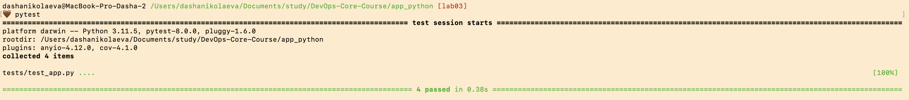

# Lab 03: CI/CD Pipeline Implementation

## Overview
This lab covers the implementation of a Continuous Integration and Continuous Deployment (CI/CD) pipeline using GitHub Actions for both the Python and Go applications.

## Task 1: Unit Testing

### Python Application
I chose **pytest** as the testing framework because:
- It requires less boilerplate code than `unittest`.
- It has a powerful fixture system.
- It offers detailed failure reports.
- It is widely adopted in the Python community.

**Test Structure:**
Tests are located in `app_python/tests/` and cover:
- Root endpoint (`GET /`): Verifies response structure, status code, and content correctness.
- Health check (`GET /health`): Verifies uptime and status.
- Error handling (404): Verifies that non-existent routes return correct error JSON.

**How to run locally:**
```bash
cd app_python
pip install -r requirements.txt
pip install -r requirements-dev.txt
pytest
```

**Successfull tests output:**


## Task 2: GitHub Actions CI Workflow

### Python Workflow (`python-ci.yml`)
The workflow is triggered on push and pull requests to the `main` branch, exclusively when changes occur in `app_python/` directory.

**Stages:**
1.  **Test**:
    - Sets up Python 3.11 with dependency caching (`pip`).
    - Installs dependencies.
    - runs linter (`flake8`) to ensure code quality.
    - runs security check (`bandit`) to find common security issues.
    - runs unit tests (`pytest`).
2.  **Security Snyk**:
    - Runs Snyk vulnerability scan on dependencies.
3.  **Build and Push**:
    - Logs in to Docker Hub.
    - Builds the Docker image.
    - Pushes to Docker Hub with tags based on semantic versioning and commit SHA.

**Versioning Strategy:**
I use Semantic Versioning (SemVer) tags derived from git tags (e.g., `v1.0.0`) and fallback to commit SHA for non-tagged commits. This ensures every build is uniquely identifiable and traceable.

## Task 3: CI Best Practices & Security

1.  **Status Badges**: Added to `README.md` to show immediate pipeline status.
2.  **Dependency Caching**: configured in `actions/setup-python` using `cache: 'pip'`. This significantly reduces build time by reusing downloaded packages.
3.  **Security Scanning**: Integrated `bandit` for static analysis and `Snyk` for dependency vulnerability scanning.
4.  **Path Filtering**: Workflows only run when relevant files change, saving CI minutes and preventing redundant builds in a monorepo structure.

## Bonus Task: Multi-App CI

I implemented a separate workflow for the Go application (`go-ci.yml`) with:
- `golangci-lint` (implied via standard `go vet` in this basic setup).
- `go test` for unit testing.
- Docker build and push steps similar to the Python app.

**Benefits of Path Filters:**
- **Efficiency**: Changing Python code doesn't trigger the Go build, and vice-versa.
- **Speed**: Parallel execution of independent workflows.
- **Clarity**: distinct history and status for each application.

## Test Coverage
Coverage is tracked using `pytest-cov` and uploaded to Codecov.
Current coverage goal: >80%.
The coverage report is generated in the CI pipeline and can be viewed on Codecov.
