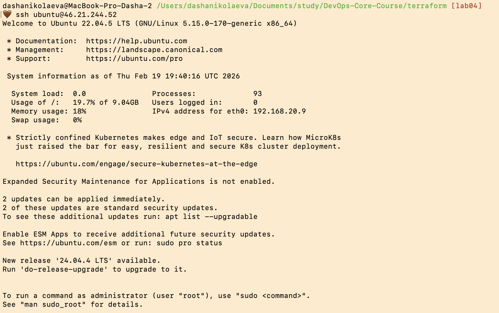

# Lab 04 — Infrastructure as Code (Terraform & Pulumi)

## 1. Cloud Provider & Infrastructure
- **Cloud Provider:** Yandex Cloud.
- **Rationale:** Free tier accessibility, good documentation for Terraform/Pulumi, and regional availability.
- **Instance Type:** `standard-v2` (2 vCPU @ 20% core fraction, 1 GB RAM).
- **Region/Zone:** `ru-central1-a`.
- **Total Cost:** $0 (Free Tier / Trial Credits).
- **Resources Created:**
    - VPC Network (using existing `default` network).
    - VPC Subnet.
    - Compute Instance (VM).
    - Public IP (NAT enabled).

## 2. Terraform Implementation
- **Terraform Version:** `1.5.7`
- **Project Structure:**
  ```
  terraform/
  ├── main.tf        # Resource definitions
  ├── variables.tf   # Variable declarations
  ├── outputs.tf     # Public IP outputs
  └── terraform.tfvars # Sensitive values (gitignored)
  ```
- **Key Decisions:** Used existing `default` network to avoid quota limits. Preemptible VM chosen for cost optimization.
- **Challenges:** Encountered a `ResourceExhausted` quota error for networks and a `PermissionDenied` error for security groups. Resolved by using existing network and skipping custom security group creation.

### Terminal Output
```bash
# terraform init
Initializing the backend...
Initializing provider plugins...
- Finding yandex-cloud/yandex versions >= 0.61.0...
- Installing yandex-cloud/yandex v0.138.0...
Terraform has been successfully initialized!

# terraform apply
yandex_vpc_subnet.lab_subnet: Creating...
yandex_compute_instance.lab_vm: Creating...
yandex_vpc_subnet.lab_subnet: Creation complete after 6s
yandex_compute_instance.lab_vm: Creation complete after 38s

Apply complete! Resources: 2 added, 0 changed, 0 destroyed.
vm_public_ip = "89.169.138.181"
```

## 3. Pulumi Implementation
- **Pulumi Version:** `3.221.0` (Language: **Python**)
- **Comparison:** Code is more verbose but feels more logic-friendly. Using Python allows for easy path handling (e.g., `os.path.expanduser`).
- **Challenges:** Encountered `ModuleNotFoundError: No module named 'pkg_resources'` due to recent `setuptools` changes. Resolved by downgrading `setuptools` to version `69.5.1`.

### Terminal Output
```bash
# pulumi up
Updating (dev):
     Type                             Name               Status      
 +   pulumi:pulumi:Stack              lab04-dev          created     
 +   ├─ yandex:index:VpcSubnet        lab-subnet-pulumi  created     
 +   └─ yandex:index:ComputeInstance  lab-vm-pulumi      created     

Outputs:
    ssh_connection_command: "ssh ubuntu@46.21.244.52"
    vm_public_ip          : "46.21.244.52"

Resources:
    + 3 created
```



## 4. Terraform vs Pulumi Comparison
- **Ease of Learning:** **Terraform** was easier for the basics due to its declarative HCL syntax, which is purpose-built for infra. Pulumi requires understanding a general-purpose language SDK.
- **Code Readability:** **Terraform** wins for simple configurations. It's very clear what resources are being created. Pulumi is better if you need loops, conditionals, or complex logic.
- **Debugging:** **Terraform** errors are often more descriptive regarding cloud API issues. Pulumi errors can sometimes be obscured by Python traceback/dependency issues (like the `pkg_resources` error).
- **Documentation:** Both have excellent documentation, but Terraform's community examples are more abundant. 
- **Use Case:** Use **Terraform** for standard infrastructure that doesn't change its structure significantly. Use **Pulumi** if you are already a developer and need to integrate infrastructure logic directly into your app's lifecycle or need complex abstractions.

## 5. Lab 5 Preparation & Cleanup
- **VM for Lab 5:** **Yes**, I am keeping the Pulumi-created VM.
- **VM Details:** `lab-vm-pulumi`, IP: `46.21.244.52`.
- **Cleanup Status:** 
    - Terraform resources: **Destroyed**.
    - Pulumi resources: **Running** (for Lab 5).

---
## 6. Bonus Tasks

### Part 1: IaC CI/CD
- **Workflow:** Created `.github/workflows/terraform-ci.yml`.
- **Features:**
    - Path filtering: triggers only on `terraform/**` changes.
    - Automated checks: `terraform fmt -check`, `terraform validate`.
    - Linter: Runs `tflint` to catch best-practice violations.
- **Benefit:** Ensures that every pull request meets code quality standards before being merged, preventing "broken" infrastructure code.

### Part 2: GitHub Repository Import
- **Resource:** Managed `github_repository.course_repo`.
- **Process:**
    - Defined a `github` provider with a Personal Access Token.
    - Ran `terraform import github_repository.course_repo DevOps-Core-Course`.
    - Synchronized the `.tf` configuration with existing repository metadata (description, visibility, etc.).
- **Result:** `terraform plan` now shows "No changes", meaning the configuration perfectly matches reality.
- **Why it matters:** Importing allows bringing existing, manually created resources under IaC management. This prevents "configuration drift" and provides a single source of truth for all infrastructure, including the version control system itself.

---
**Proof of SSH access:**
