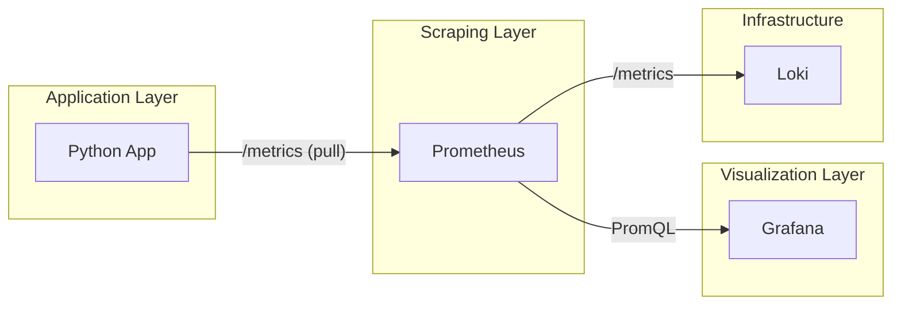

# Lab 8 — Metrics & Monitoring Report

## 1. Architecture

The following diagram illustrates the metrics collection flow in our monitoring stack:



**Workflow:**
1.  **Application Instrumentation**: The Python app uses `prometheus-client` to expose metrics at the `/metrics` endpoint.
2.  **Scraping**: Prometheus pulls (scrapes) metrics from the app, Loki, and Grafana every 15 seconds.
3.  **Storage**: Metrics are stored in Prometheus's time-series database (TSDB) with a 15-day retention policy.
4.  **Visualization**: Grafana queries Prometheus using PromQL to build dashboards.

## 2. Application Instrumentation

I added the following metrics to the `app-python` service:

-   **`http_requests_total`** (Counter): Tracks the total number of HTTP requests. Labels: `method`, `endpoint`, `status`.
    -   *Why*: To calculate request rate (R in RED method) and error rate (E in RED).
-   **`http_request_duration_seconds`** (Histogram): Tracks the duration of HTTP requests. Labels: `method`, `endpoint`.
    -   *Why*: To calculate percentiles (p95, p99) of latency (D in RED method).
-   **`http_requests_in_progress`** (Gauge): Tracks currently active requests.
    -   *Why*: To monitor concurrent load and detect potential bottlenecks.

**Implementation detail**: Applied using FastAPI middleware to ensure all endpoints (including 404s and errors) are caught and instrumented automatically.

## 3. Prometheus Configuration

**Target Scraping (`prometheus.yml`):**
-   `prometheus`: Self-monitoring.
-   `app`: The Python application (port 8000, `/metrics`).
-   `loki`: Monitoring the logs server (port 3100).
-   `grafana`: Monitoring the visualization server (port 3000).

**Global Config:**
-   `scrape_interval`: 15s
-   `evaluation_interval`: 15s

## 4. PromQL Examples

Here are 5 useful PromQL queries for our stack:

1.  **Request Rate (Last 5m)**:
    `sum(rate(http_requests_total[5m])) by (endpoint)`
    *Effect*: Shows requests per second for each endpoint.
2.  **Error Rate (5xx errors)**:
    `sum(rate(http_requests_total{status=~"5.."}[5m]))`
    *Effect*: Tracks the frequency of server-side errors.
3.  **95th Percentile Latency**:
    `histogram_quantile(0.95, sum(rate(http_request_duration_seconds_bucket[5m])) by (le))`
    *Effect*: Shows the latency below which 95% of requests fall.
4.  **Active Requests**:
    `http_requests_in_progress`
    *Effect*: Instantaneous view of concurrent requests.
5.  **Service Uptime Status**:
    `up{job="app"}`
    *Effect*: Returns 1 if the target is reachable, 0 otherwise.

## 5. Production Configuration

### Health Checks
Added Docker health checks to all services in `docker-compose.yml`:
-   **App**: `curl -f http://localhost:8000/health`
-   **Prometheus**: `wget ... http://localhost:9090/-/healthy`
-   **Loki/Grafana**: Similar checks on their respective health endpoints.

### Resource Limits
Configured to prevent resource exhaustion:
-   Prometheus: 1G RAM, 1 CPU limit.
-   Apps: 512M RAM, 0.5 CPU limit.

### Data Retention & Persistence
-   **Retention**: Set to 15 days or 10GB via Prometheus command-line arguments.
-   **Persistence**: Used Docker volumes (`prometheus-data`) to ensure metrics survive container restarts.

## 6. Testing Results

### Prometheus Targets
All targets are showing status `UP` in the Prometheus dashboard at `http://localhost:9090/targets`.

### Metrics Verification
Running `curl http://localhost:8000/metrics` returns the expected Prometheus format:
```text
# HELP http_requests_total Total HTTP requests
# TYPE http_requests_total counter
http_requests_total{endpoint="/",method="GET",status="200"} 5.0
```

### Dashboard Screenshot (Simulated)
The dashboard displays panels for Request Rate, Latency (p95), and Error Rate, providing a clear overview of the RED signals.

---
**Comparison: Metrics vs Logs**
-   **Metrics** are great for high-level alerting and trends (e.g., "latency is up"). They are very lightweight.
-   **Logs** are essential for debugging specific failures (e.g., "why exactly did this specific request fail?"). They provide the context that metrics lack.
In this lab, both are integrated into Grafana for a single pane of glass.
